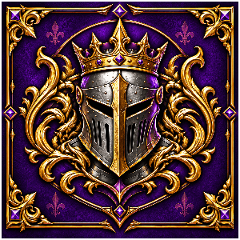

# 666 DuelYard

### EU Mordhau Duel Server

**NO FFA** &nbsp; • &nbsp; **128 TICKRATE** &nbsp; • &nbsp; **ACTIVE ADMINS** &nbsp; • &nbsp; **CLEAN DUELS**

*Flourish first. Fight clean. Duel with honor.*

[**JOIN DISCORD**](https://discord.gg/kakashii666)

---

  

> ### Before you attack
> Challenge your opponent with a **Flourish (`X` + `1`)**.  
> The duel starts only after **both Flourishes are completely finished**.

---

## How Duels Work

| 01 — Challenge | 02 — Accept | 03 — Fight |
|:--|:--|:--|
| Face your opponent at a safe distance and press **`X` → `1`**. | Wait for your opponent to Flourish back. **No return Flourish = no duel.** | Wait until both Flourish animations are finished, then the duel begins. |

**Do not interfere with active duels.** Do not block, bump, body-block or stand inside another fight. Heal and re-equip **away from the duel area**.

  

---

## Server Rules

1. **No FFA.** One fight per ring.
2. **Do not interfere** with ongoing duels.
3. **No ranged weapons, horses, catapults, firepots or toolbox.**
4. **No spawn killing or griefing.** No toxic chat or slurs.
5. **Respect line order.** No cutting.
6. **No looting active fighters.**
7. **Flourish first.** No surprise hits.
8. **Use common sense. Admins have final say.**

  

---

## Duel Etiquette

| Give Fights Space | Return Gear |
|:--|:--|
| Stay clear of active fights. Heal, re-equip and sort your loadout away from duel areas. | If you pick up another player's weapon and they want it back, return it or drop it nearby. |

- Always begin with a **Flourish (`X` + `1`)**.
- Do not crowd or interrupt a duel in progress.
- Heal and re-equip **away from active fights**.
- If somebody clearly wants their weapon back, return it.

---

## Map Rotation

- At the end of each match, vote for one of the listed maps.
- Admins may change the map when chat requests something else or when another map provides better server flow.

---

  

## Reports & Admins

If somebody breaks the rules, **record a short clip when possible** and open a ticket on Discord.

**In game:** look for players with the **[Admin]** or **[Mod]** tag.

**Progressive actions:** `Warn` → `Kick` → `Temp Ban` → `Ban`

### [Open Discord / Create a Ticket](https://discord.gg/kakashii666)

`discord.gg/kakashii666`

---

## Support The Server

Invite friends, be welcoming to new duelers and send us your feedback on Discord. Keep the yard competitive without turning it toxic.

### Have fun and duel with honor.

**666 DuelYard**  
EU Mordhau Duel Server · No FFA · 128 Tickrate Heaven

